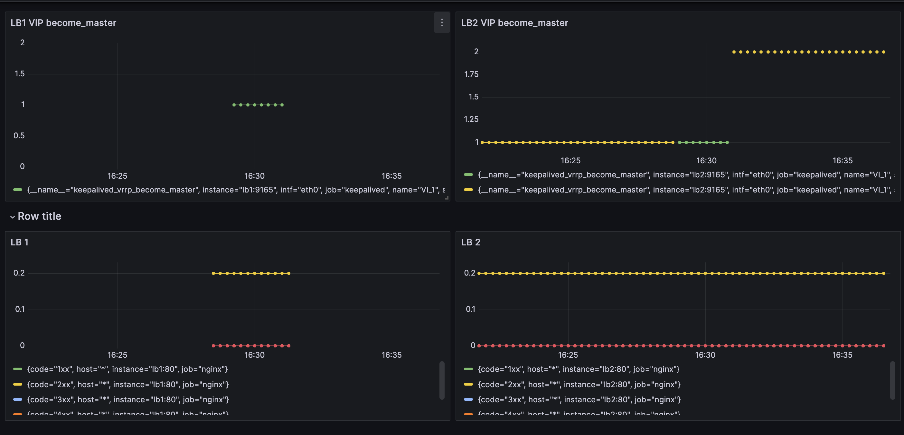
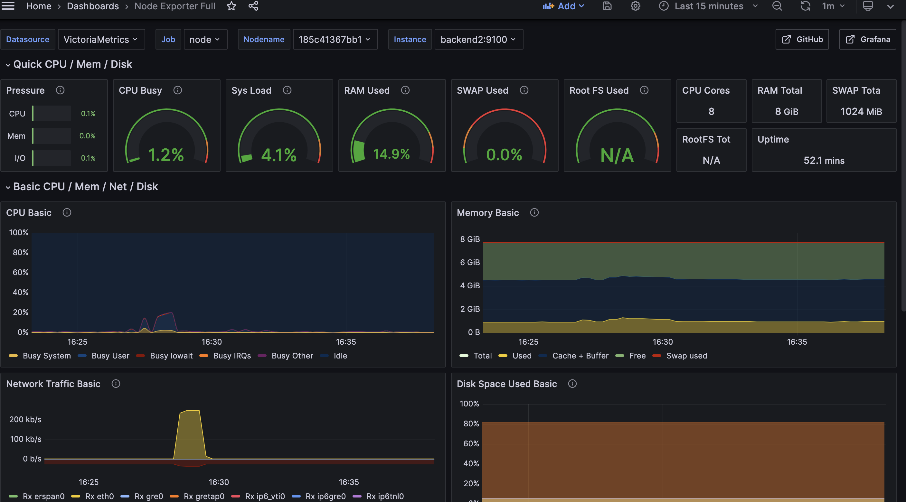

# HA Infra Template

Этот проект демонстрирует настройку высокодоступной (High Availability) инфраструктуры с использованием Docker, Ansible, Nginx, Keepalived и простого бэкенд-приложения.

## Требования к запуску

Полный список требований см. [REQUIREMENTS.md](docs/REQUIREMENTS.md)

## Начало работы

### 1. Подготовка

1.  **Клонируйте репозиторий:**
    ```bash
    git clone https://github.com/enginewww/ha-infra-template.git
    cd ha-infra-template
    ```

2.  **Сгенерируйте SSH-ключи:**
    Ключи необходимы для подключения Ansible к контейнерам по SSH.
    ```bash
    ssh-keygen -t ed25519 -f ./.ssh/id_ed25519 -N ""
    ```

### 2. Запуск окружения

Используйте Docker Compose для сборки и запуска всех контейнеров в фоновом режиме.

```bash
docker compose up --build -d
```

### 3. Настройка через Ansible

1.  **Войдите в контейнер `ansible`:**
    ```bash
    docker exec -it ansible /bin/bash
    ```

2.  **Перейдите в рабочую директорию:**
    ```bash
    cd ./ansible
    ```

3.  **Запустите плейбуки Ansible:**
    ```bash
    ansible-playbook playbook_lb.yaml && \
    ansible-playbook playbook_ha.yaml && \
    ansible-playbook playbook_backend.yaml && \
    ansible-playbook playbook_monitoring.yaml
    ```

## Проверка работоспособности

> **Примечание:** часть команды после символа `|` можно опускать, если вы уверенно читаете вывод Ansible.


### 1. Балансировка трафика

1. **Определите VIP:**
    ```bash
    ansible-playbook playbook_showVIP.yaml | grep "VIP:"
    ```
2. **Сделайте http запрос к этому VIP**

    Вместо '\<VIP>' вставьте VIP из вывода предыдущей команды
    ```bash
    curl http://<VIP>:80
    ```
    Должна вернуться html-страница в "сыром" виде с текстом "Бэкенд 1" или "Бэкенд 2"

### 2. Кластеризация балансировщиков
1. **Определите активную нодy с VIP:**
    ```bash
    ansible-playbook playbook_whichVIP.yaml |  grep 'название ноды c VIP'
    ```
    Скопируйте название ноды c VIP из вывода команды.

    Скорее всего(если не делать изменения в рабочих файлах)
    в выводе команды будет нода с названием lb1
2.  **Выйдите из контейнера `ansible`:**
    ```bash
    exit
    ```
3. **Остановите активную ноду**
    ```bash
    docker stop <название ноды c VIP>
    ```
4.  **Войдите в контейнер `ansible`:**
    ```bash
    docker exec -it ansible /bin/bash
    ```
5.  **Перейдите в рабочую директорию:**
    ```bash
    cd ./ansible
    ```
6. **Убедитесь, что VIP переключился на другую ноду**
    ```bash
    ansible-playbook playbook_whichVIP.yaml |  grep 'название ноды c VIP'
    ```
7. **Снова определите VIP(если забыли сохранить):**
    ```bash
    ansible-playbook playbook_showVIP.yaml | grep "VIP:"
    ```
8. **Убедитесь, что запросы продолжают обслуживаться**

    Вместо '\<VIP>' вставьте VIP из вывода предыдущей команды
    ```bash
    curl http://<VIP>:80
    ```

### 3. Мониторинг

1.  Откройте Grafana в браузере: [http://localhost:3000](http://localhost:3000) (или IP вашего хоста).
2.  Войдите, используя учетные данные по умолчанию:
    -   **Логин:** `admin`
    -   **Пароль:** `admin`
3.  Исследуйте дашборды для просмотра метрик.

## Архитектура

- **2 балансировщика нагрузки (lb1, lb2):** Nginx + Keepalived для обеспечения отказоустойчивости.
- **2 бэкенд-сервера (backend1, backend2):** Apache для обслуживания контента.
- **1 узел управления Ansible (ansible):** контейнер для запуска плейбуков.
- **Мониторинг (victoria-metrics, grafana):** Grafana и Victoria Metrics для сбора и визуализации метрик.

## Скриншоты дашбордов Grafana
network status

node status
